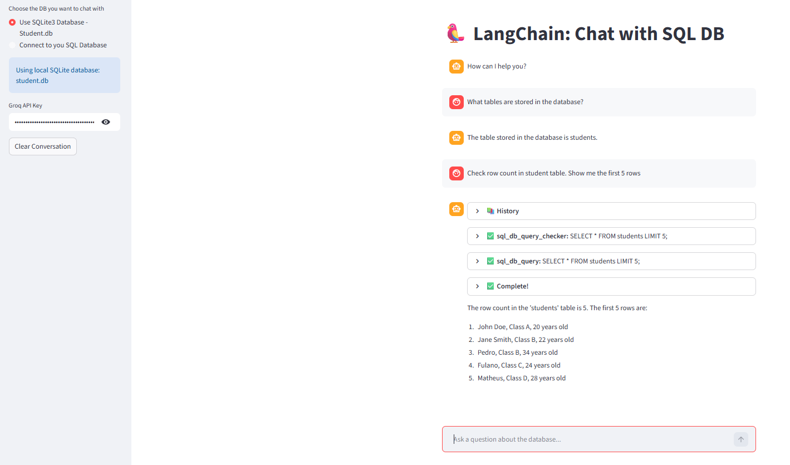

# Chat SQL DB

A simple Streamlit app that lets users ask questions to a SQL database using natural language.

The project uses LangChain SQL Agents, Groq LLMs, SQLAlchemy, SQLite, and optional MySQL connection to transform user questions into SQL queries and return answers through a chat interface.

## Demo




## Features

- Chat interface built with Streamlit
- Natural language questions over SQL databases
- Local SQLite database support
- Optional MySQL database connection
- LangChain SQL Agent integration
- Groq LLM integration
- Simple demo database with student records

## Tech Stack

- Python
- Streamlit
- LangChain
- Groq
- SQLAlchemy
- SQLite
- MySQL

## Example Questions

```text
How many students are in the database?
```

```text
List all students from class B.
```

```text
What is the average age of the students?
```

```text
Who is the oldest student?
```

## Getting Started

### 1. Clone the repository

```bash
git clone https://github.com/matcgoes/chat_sql_db.git
cd chat_sql_db
```

### 2. Create a virtual environment

```bash
python -m venv env
```

Activate it:

```bash
# Windows
env\Scripts\activate

# macOS/Linux
source env/bin/activate
```

### 3. Install dependencies

```bash
pip install -r requirements.txt
```

### 4. Create the SQLite demo database

```bash
python sqlite.py
```

### 5. Run the app

```bash
streamlit run app.py
```

## Environment Variables

Do not commit API keys, passwords, or `.env` files.

Recommended `.gitignore` entries:

```gitignore
.env
*.env
env/
venv/
.venv/
__pycache__/
*.db
*.sqlite
*.sqlite3
```

You can create a `.env.example` file to document the required variables without exposing secrets:

```env
GROQ_API_KEY=your_groq_api_key_here
MYSQL_HOST=your_mysql_host_here
MYSQL_USER=your_mysql_user_here
MYSQL_PASSWORD=your_mysql_password_here
MYSQL_DATABASE=your_database_name_here
```

## Security Note

This project is intended for learning and experimentation.  
For production use, connect the agent only to databases with restricted permissions, preferably read-only access.

## About

This project demonstrates how Large Language Models can be connected to relational databases to make data exploration more conversational and accessible.
